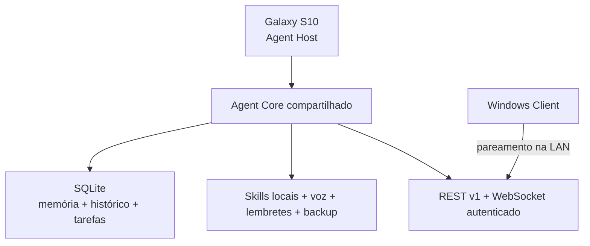

# Agent V0 ChatGPT

V0 funcional de um agente pessoal local-first. O Samsung Galaxy S10 hospeda o
Agent Core, a memória SQLite, a fila concorrente, voz, lembretes, backups e a
API. O aplicativo Windows é um painel remoto: ele não cria um segundo Core nem
se torna outra fonte de verdade.

O agente inicia e mantém as funções locais sem OpenAI, Anthropic, Google ou
qualquer chave externa. Providers futuros são ferramentas opcionais.

## Status desta release

- 20 testes automatizados: 20 passaram, 0 falharam.
- Android: `SOURCE_BUILD_PASS`; APK debug criado e lint aprovado.
- Desktop: `SOURCE_BUILD_PASS`; distribuição Linux criada.
- Windows `.exe`: `WINDOWS_EXE_NOT_BUILT_ENVIRONMENT_LIMITATION` — a tarefa foi
  tentada e corretamente ignorada pelo Compose no host Linux.
- Galaxy S10, áudio real, Wi-Fi real e DPAPI no Windows:
  `UNTESTED_ON_REAL_DEVICE`.

Consulte [docs/TEST_MATRIX.md](docs/TEST_MATRIX.md) e
[COMPARISON_MANIFEST.md](COMPARISON_MANIFEST.md) para a classificação completa.

## Arquitetura

Stack fixa da V0:

- Kotlin Multiplatform e Compose Multiplatform;
- Kotlin Coroutines, Flow e Channels;
- SQLDelight sobre SQLite;
- Ktor REST + WebSocket;
- Foreground Service Android;
- Compose Desktop como cliente remoto.



Veja [docs/ARCHITECTURE.md](docs/ARCHITECTURE.md).

## Módulos

| Módulo | Responsabilidade |
| --- | --- |
| `shared` | Agent Core, banco, memória, contexto, tarefas, eventos, skills, router, providers, API/cliente e testes |
| `androidApp` | Host S10, foreground service, banco, Ktor, voz, notificações, backup, pareamento e armazenamento seguro |
| `desktopApp` | Dashboard Windows remoto, chat, memória, tarefas, eventos, configurações e pareamento |

## Requisitos de build

- JDK 17;
- Gradle Wrapper 8.10.2 incluído;
- Android SDK oficial, platform 35 e build-tools 35 para Android;
- Windows 10/11 para gerar e validar o `.exe` nativo.

Crie um `local.properties` não versionado:

```properties
sdk.dir=C:\caminho\para\Android\Sdk
```

No Linux/macOS use o caminho absoluto local com `/`.

## Compilar e testar

Linux/macOS:

```shell
./gradlew :shared:desktopTest
./gradlew :androidApp:assembleDebug :androidApp:lintDebug
./gradlew :desktopApp:compileKotlinDesktop
```

Windows:

```bat
gradlew.bat :shared:desktopTest
gradlew.bat :androidApp:assembleDebug
gradlew.bat :desktopApp:packageExe
```

O APK debug é gerado em:

```text
androidApp/build/outputs/apk/debug/androidApp-debug.apk
```

## Instalar e iniciar no Galaxy S10

Com depuração USB habilitada:

```shell
adb install -r androidApp/build/outputs/apk/debug/androidApp-debug.apk
```

No telefone:

1. Abra **Agent V0 ChatGPT**.
2. Toque em **Iniciar Core**.
3. Autorize notificações quando solicitado.
4. Para voz, toque em **Ativar voz** e autorize o microfone.
5. Ajuste a otimização de bateria pela tela oficial aberta pelo app.

O Agent Core roda no foreground service e continua após fechar a interface,
enquanto o Android permitir. A notificação persistente mostra estado, endereço
da API e ações de standby, mute, pareamento e parada. Force-stop manual impede
restart até nova abertura, conforme as regras do Android.

## Parear o Windows com o S10

1. Coloque os dois dispositivos na mesma rede local.
2. No S10, toque em **Parear Windows**.
3. Anote o endereço mostrado (`IP:8787`) e o código de seis dígitos.
4. Execute o cliente:

   ```shell
   ./gradlew :desktopApp:run
   ```

   No Windows use `gradlew.bat :desktopApp:run` ou o `.exe` gerado no Windows.
5. Abra **Configurações**, informe `http://IP-DO-S10:8787` e reconecte.
6. Informe o nome do computador e o código exibido no S10.

O código dura cinco minutos, aceita no máximo cinco erros e só funciona uma
vez. O host guarda apenas um hash com segredo local. O Windows protege o token
com DPAPI do usuário. A API volta a localhost se a janela expirar sem sucesso.
Veja [docs/PAIRING_AND_LAN.md](docs/PAIRING_AND_LAN.md).

## Painel Windows

O menu inclui Dashboard, Chat, Memória, Projetos, Skills, Tarefas, Lembretes,
Histórico, Dispositivos, Modelos, Logs e Configurações. O WebSocket atualiza
atividade ao vivo; após queda de rede, o cliente reconecta e recupera o estado
autoritativo por REST.

Veja [docs/WINDOWS_CLIENT.md](docs/WINDOWS_CLIENT.md).

## Voz

Estados implementados:

`STANDBY`, `LISTENING`, `THINKING`, `PROCESSING`, `SPEAKING`, `MIC_MUTED` e
`ERROR`.

- **Agente** ativa a conversa e responde “Estou aqui.”
- Depois da ativação, a conversa permanece contínua sem repetir a wake word.
- **Agente standby** retorna ao modo de wake word.
- `MIC_MUTED` cancela o reconhecimento; nesse estado não existe wake word.
- Toda fala reconhecida e resposta são persistidas na mesma conversa do chat.

A implementação usa somente o `SpeechRecognizer` on-device do Android e não faz
fallback para reconhecimento em rede. Ela exige Android 12/API 31+ e um pacote
offline em português disponível no aparelho. TTS usa uma voz portuguesa local
quando instalada. Wake word, STT, TTS e barge-in acústico permanecem
`PARTIAL / UNTESTED_ON_REAL_DEVICE` até o teste no Galaxy S10.

Veja [docs/ANDROID_HOST.md](docs/ANDROID_HOST.md).

## Banco, memória e histórico

O arquivo `agent-v0.db` fica no armazenamento privado do aplicativo Android.
O schema normalizado contém conversas, mensagens originais, memórias, entidades,
relações, projetos, tarefas/eventos, skills/permissões, lembretes, dispositivos,
configurações, uso de providers, auditoria e backups.

Memórias: `WORKING`, `EPISODIC`, `SEMANTIC`, `PROJECT`, `PREFERENCE`,
`DECISION` e `LESSON`. A V0 usa busca textual, relações e recência; embeddings e
LLM local são opcionais futuros. O histórico original nunca é substituído por
resumos.

## Tarefas, skills e providers

A fila possui dois workers supervisionados no host Android. Tarefas longas não
bloqueiam chat, oferecem cancelamento e só exibem progresso quando há evidência
real.

Skills V0: Memory, Reminder, System Status e Echo. O router resolve status,
memória, lembretes e tarefas localmente. `MockAIProvider` é funcional apenas
para testes. OpenAI, Anthropic, Gemini, modelo local e imagem são contratos não
configurados; nenhuma chave é necessária para iniciar.

## Lembretes

Lembretes persistem no SQLite e o scheduler continua no foreground service. No
Android, o disparo cria uma notificação local real. O scheduler e a entrega no
Galaxy S10 ainda precisam de validação de bateria/restart em aparelho físico.

## Backup e restauração

No Android, **Criar backup** executa checkpoint do WAL e `VACUUM INTO`, valida
tamanho, SHA-256 e `PRAGMA integrity_check`, e guarda o snapshot em
`noBackupFilesDir`. **Restaurar último** exige confirmação, fecha o Core, copia
para staging com `fsync`, valida, mantém rollback e reinicia o Core. A API
autenticada também lista/cria/restaura snapshots.

O Teste I comprova o fluxo equivalente em SQLite/JVM. O código Android compila
e passa lint, mas seu fluxo de filesystem/SQLite é `UNTESTED_ON_REAL_DEVICE`.
Backups não incluem os secrets criptografados do pareamento.

## Segurança e segredos

- localhost por padrão;
- LAN somente durante pareamento explícito ou após cliente autorizado;
- bearer token obrigatório em toda rota administrativa e WebSocket;
- hash do token no SQLite; segredo do servidor em preferências criptografadas;
- DPAPI no Windows;
- áudio ambiente não é transmitido continuamente;
- `.env`, bancos, backups, tokens e chaves são ignorados pelo Git;
- logs/eventos não recebem credenciais.

`.env.example` contém apenas providers futuros opcionais.

## API V1

Principais rotas: health/status, pairing, chat, conversations, memories,
projects, tasks/cancel, reminders, skills, devices/revoke, backups/restore e
events WebSocket. Health e pareamento são públicos; o restante é autenticado no
host Android.

## Limitações honestas

- Nenhum Galaxy S10 estava conectado ao ambiente de build.
- Wake word/STT/TTS, notificações, restart, bateria, backup Android e Wi-Fi real
  ainda precisam de teste físico.
- O Windows `.exe` não foi gerado nem validado porque a construção ocorreu em
  Linux. O código Desktop e uma distribuição Linux foram compilados.
- DPAPI compila, mas precisa de execução em Windows.
- Providers externos, modelo local grande, embeddings, cloud sync, Alexa,
  WhatsApp, smart home, GitHub, Cloudflare e geração real de imagem não fazem
  parte da V0.
- A V0 é single-user/local-LAN, não um produto multiusuário comercial.

## Documentos de continuidade

1. [AGENT_MASTER_CONTEXT.md](AGENT_MASTER_CONTEXT.md)
2. [WORKER_STATE.md](WORKER_STATE.md)
3. [TODO_V0.md](TODO_V0.md)
4. [CHANGELOG.md](CHANGELOG.md)
5. [COMPARISON_MANIFEST.md](COMPARISON_MANIFEST.md)
6. [docs/TEST_MATRIX.md](docs/TEST_MATRIX.md)
