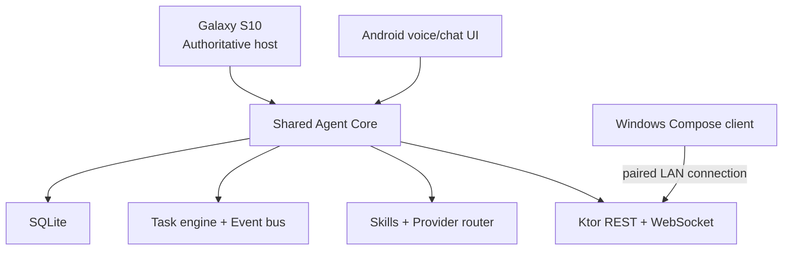

# Architecture Decision Record — V0

## Decision

The V0 uses **Kotlin Multiplatform**, **Compose Multiplatform**, **Kotlin
Coroutines/Flow**, **SQLDelight/SQLite**, and **Ktor**.

This decision is fixed for the V0 unless a verified platform blocker is found.

## Why this stack

- Domain models, database queries, task engine, event bus, routing, skills,
  provider contracts, API models, and tests can be shared between Android and
  Windows.
- Android can host the authoritative Agent Core in a foreground service.
- Windows can be a Compose Desktop client instead of a second source of truth.
- Coroutines make long-running tasks independent from chat/UI threads.
- SQLDelight provides typed SQLite access and versioned migrations on both
  targets.
- Ktor supports a local REST API and WebSocket event stream without introducing
  another implementation language.

## Runtime topology

The Android host remains functional when the Windows client is offline. A JVM
development-host mode may be introduced for tests, but it is not a second
production Agent Core.

## Modules

| Module | Responsibility |
| --- | --- |
| `shared` | Agent Core domain, SQLDelight schema, event bus, managers, API contracts, tests |
| `androidApp` | S10 host lifecycle, foreground service, notifications, Android voice adapters, secure storage |
| `desktopApp` | Windows dashboard/client, remote API and WebSocket connection |

## Data and trust boundaries

- SQLite on the host is the durable source of truth.
- Original messages are retained; summaries never replace history.
- JSON is limited to flexible metadata/configuration.
- The API binds to localhost by default. LAN exposure requires explicit enablement.
- Paired clients use device tokens; only hashes are stored in SQLite.
- Secrets are platform-secure values and never event/log metadata.
- External providers are optional tools, not the agent itself.

## Availability model

Subsystems expose contracts and supervise their own coroutine work. Provider,
skill, voice, or network failure must be represented as an event/result and
must not cancel the root Agent Core scope.

## Current implementation status

- Shared Agent Core and 20 automated tests: `FUNCTIONAL`.
- SQLDelight schema/repositories, message history, memory/project relations,
  concurrent tasks, reminders, desktop backup and API contract: `FUNCTIONAL`.
- Android host source, APK and lint: `SOURCE_BUILD_PASS`; foreground service,
  Ktor host, offline speech/TTS, notifications and backup remain
  `UNTESTED_ON_REAL_DEVICE`.
- Compose Desktop remote panel: `SOURCE_BUILD_PASS`; Linux distribution built.
- Pairing/authenticated REST/WebSocket: `FUNCTIONAL` in Test K and
  `UNTESTED_ON_REAL_DEVICE` over Wi-Fi.
- Windows `.exe`: `WINDOWS_EXE_NOT_BUILT_ENVIRONMENT_LIMITATION`.
- External providers: contracts only; `MockAIProvider` is `MOCK` and tested.
